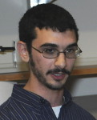
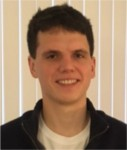
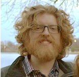

# NIMH Reproducibility Workshop, August 2017
Repository for the NIMH Workshop on Open and Reproducible Neuroscience on Aug 1 &amp; 2, 2017
Many thanks to everyone who helped make this workshop possible and to everyone who attended.
## Course Leads and Guests Speakers:
 |  |  |  |  |  | 
--- | --- | --- | --- | --- | --- | ---  
[Satra Ghosh](http://satra.cogitatum.org/) | [Yarik Halchenko](http://haxbylab.dartmouth.edu/ppl/yarik.html) | Wolfgang Resch | Afif Elghraoui | Adam Thomas | John Lee | Dylan Nielson
MIT | Dartmouth | [NIH HPC Team](http://hpc.nih.gov/) | [NIH HPC Team](http://hpc.nih.gov/) | [NIMH DSST](https://cmn.nimh.nih.gov/dsst) | [NIMH DSST](https://cmn.nimh.nih.gov/dsst) | [NIMH DSST](https://cmn.nimh.nih.gov/dsst)

## Workshop contents

### Tuesday Morning
Adam opened the course with a presentation on the [reasons for doing open, reproducible science](materials/ReproCourseIntro_Aug.pdf).  
John led the [setup of our working environment for the course](materials/course_setup.ipynb).  
Wolfgang and Afif led an interactive session on singularity containers: [Slides](https://hpc.nih.gov/training/handouts/170801_singularity.svg#1_0), [Demo Readme](https://hpc.nih.gov/training/handouts/170801_singularity_demo.html).  
John presented a [Git refresher]().

### Tuesday Afternoon

Yarik told everyone about [DataLad](http://datalad.org/) and walked us through a demo of using DataLad to manage datasets with [git-annex](https://git-annex.branchable.com/).  
Closing out the Tuesday, Dylan walked everyone through the first half of [Nipype's Python Tutorial](https://djarecka.github.io/nipype_tutorial/notebooks/introduction_python.html).

### Wednesday Morning

Dylan took everyone through [Nipype's Python Tutorial](https://djarecka.github.io/nipype_tutorial/notebooks/introduction_python.html) up to the final Module's section.  
Satra presnted an [introduction to Nipype](materials/nipype.pdf) and [hands-on reproducible analytics](materials/nipype-1.pdf) with a walkthough of the [preprocessing tutorial](https://djarecka.github.io/nipype_tutorial/notebooks/example_preprocessing.html)

### Wednesday Afternoon

Satra gave us a live demo of using [Heudiconv](https://github.com/nipy/heudiconv) to convert dicoms into a [BIDS dataset](http://bids.neuroimaging.io/).

## Other links

[Workshop scratch pad](https://docs.google.com/document/d/1jqSoF5R3G355cn8u5yxx6hcl1Vu_NbLMe8wMurQjcqE/edit?usp=sharing)  
[Workshop setup instructions](https://docs.google.com/document/d/11Byl0wZ5FSqaj3lhMPlDmwaFUP-xQ8Cm8EgNEaBjmgw/edit?usp=sharing)  
[Ask questions on NeuroStars](https://neurostars.org)  
[Join the Brainhack community on Slack](https://brainhack-slack-invite.herokuapp.com/) or look through the [archives](https://brainhack.slackarchive.io/general/)  
[Learn Git game](learngitbranching.js.org)  
[Learn Python with Code Academy](https://www.codecademy.com/learn/python)  
[NeuroDocker](https://github.com/kaczmarj/neurodocker)  
[DataLad](http://datalad.org/)  
NIMH DSST's Heudiconv scripts(link coming soon)
[Nipype Github](https://github.com/nipy/nipype)  
[Nipype Tutorials](https://djarecka.github.io/nipype_tutorial/)  
[Nipype Documentation](https://nipype.readthedocs.io/en/latest/)  
**Nipype Apps**  
[Mindboggle](https://mindboggle.readthedocs.io/en/latest/)  
[Configurable Pipeline for the Analysis of Connectomes](https://fcp-indi.github.io/)  
[FMRI Prep](https://fmriprep.readthedocs.io/en/stable/index.html)   
[MRIQC](https://mriqc.readthedocs.io/en/stable/)

